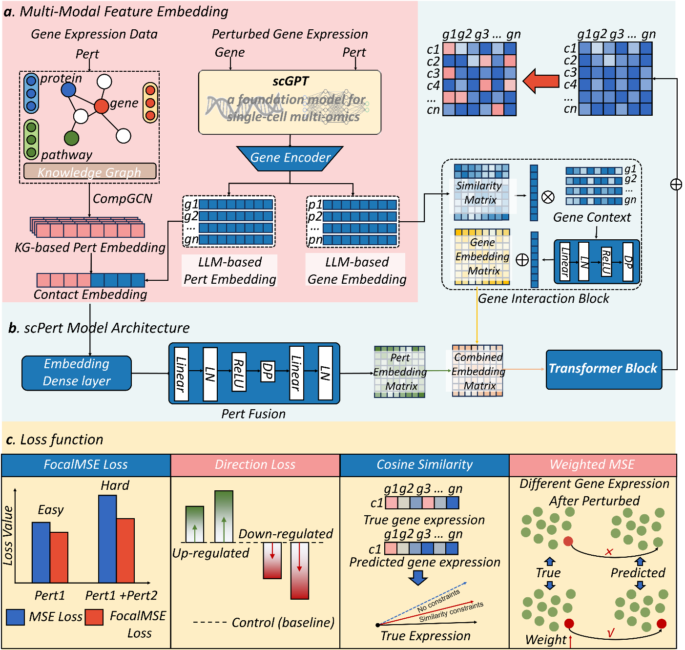

# scPert: A Multi-Modal Transformer Framework for Predicting Single-Cell Transcriptomic Responses to Genetic Perturbations
**scPert** is a multi-modal transformer framework that accurately predicts single-cell transcriptomic responses to genetic perturbations by integrating scGPT's gene embeddings with structured biological knowledge from Hetionet. Our method significantly outperforms existing approaches (GEARS and scGPT), demonstrating a **56.6% MSE** improvement for combinatorial perturbations while precisely modeling non-additive genetic interactions. Validated across 42 cancer-relevant genes, scPert achieves excellent prediction quality (**≥0.8**) for **76.9%** of cases, showing particular strength in clinically-relevant scenarios like p53 pathway modeling (**r=0.927**) and immune checkpoint regulation. This robust, scalable tool enables reliable in silico perturbation studies for drug discovery and virtual cell construction.



## Installation
Install [PyG](https://pytorch-geometric.readthedocs.io/en/latest/notes/installation.html), and then do `pip install scpert`
## Requirement
- anndata==0.9.2
- scanpy==1.9.8
- torch==2.3.0
- torch-geometric==2.6.1
- scvi-tools==0.20.3
- pandas==2.0.3
- numpy==1.24.4
- scipy==1.10.1
- cell-gears==0.0.2
- nvidia-cublas-cu12==12.1.3.1
- nvidia-cudnn-cu12==8.9.2.26
- flash_attn==0.2.8
## Usage
`embedding_dir`: Directory containing gene embedding files (.npy)

`data_path`: Base directory for perturbation datasets

`model_path`: Pretrained model directory containing model.pt

`pert_file`:CSV file specifying perturbation pairs with columns: gene1,gene2

You can train scPert on your perturbation dataset simply running the Python script:
```
python ./scripts/train.py
```
You can use scPert to predict single gene or gene pairs perturbations by running the scripts:

``` 
python ./scripts/infer.py
```
Using API Interface:
```
from scpert import ProcePertdata,scPert

pertData = ProcePertdata(data_path)
pertData.load(DataName = 'norman')

# training
SCPert = scPert(pertData, device = 'cuda:0')
SCPert.model_initialize(hidden_size = 64)
SCPert.train(epochs = 20)

# saving or loading model
SCPert.save_model(model_path)
SCPert.load_pretrained(model_path)

# predict
SCPert.predict([['PRDM1+CBFA2T3'], ['FEV']])
SCPert.GI_predict(['CBL', 'CNN1'])
```
## Cite Us
This work is currently under peer review.
